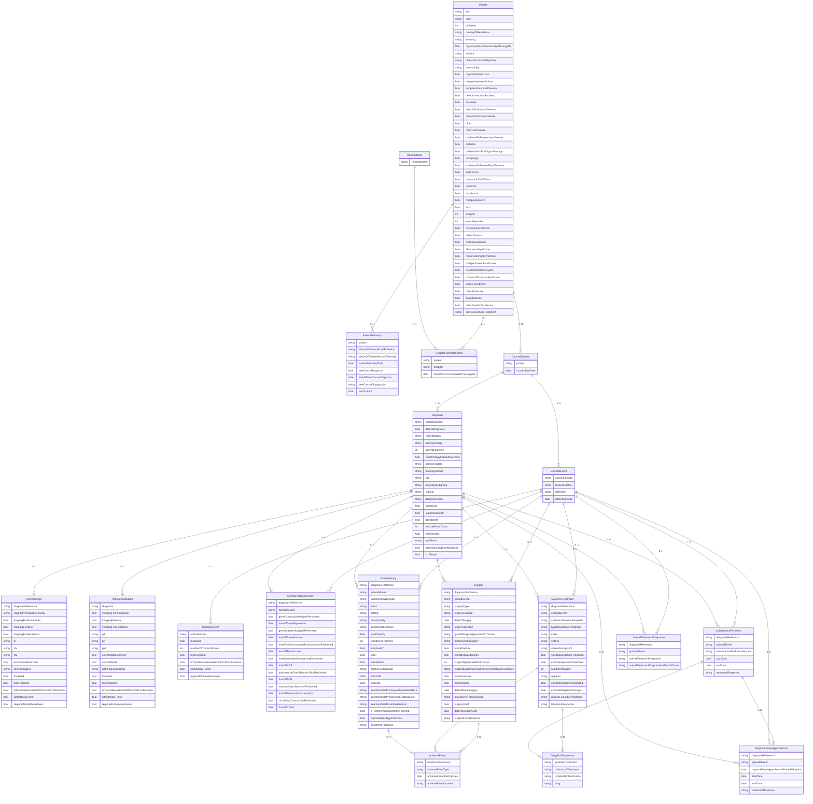

```mermaid
erDiagram
    Patient {
      string sex
      string race
      int    birthYear
      string countryOfResidence
      string smoking
      float  cigarettesPackYearsSmokedDuringLife
      string alcohol
      string charlsonComorbidityIndex
      string comorbidity
      bool   myocardialInfarction
      bool   congestiveHeartFailure
      bool   peripheralVascularDisease
      bool   cerebrovascularAccident
      bool   dementia
      bool   chronicPulmonaryDisease
      bool   connectiveTissueDisease
      bool   ulcer
      bool   mildLiverDisease
      bool   moderateToSevereLiverDisease
      bool   diabetes
      bool   diabetesWithEndOrganDamage
      bool   hemiplegia
      bool   moderateToSevereRenalDisease
      bool   solidTumor
      bool   metastaticSolidTumor
      bool   leukemia
      bool   lymphoma
      bool   multipleMyeloma
      bool   aids
      int    ecogPS
      int    karnofskyIndex
      bool   noGeneticSyndrome
      bool   olliersDisease
      bool   maffuciSyndrome
      bool   liFraumeniSyndrome
      bool   mccuneAlbrightSyndrome
      bool   multipleOsteochondromas
      bool   neurofibromatosisType1
      bool   rothmundThomsonSyndrome
      bool   wernerSyndrome
      bool   retinoblastoma
      bool   pagetDisease
      bool   otherGeneticSyndrome
      string previousCancerTreatment
    }

    PatientFollowUp {
      string patient
      string statusOfPatientAtLastFollowUp
      string statusOfDiseaseAtLastFollowUp
      date   patientFollowUpDate
      bool   newCancerDiagnosis
      date   dateOfNewCancerDiagnosis
      string newCancerTopography
      date   lastContact
    }

    HospitalData {
      string hospitalName
    }

    HospitalPatientRecords {
      string patient
      string hospital
      date   dateOfFirstContactWithTheHospital
    }

    CancerEpisode {
      string patient
      date   cancerStartDate
    }

    Diagnosis {
      string cancerEpisode
      date   dateOfDiagnosis
      string typeOfBiopsy
      string biopsyDoneBy
      int    ageAtDiagnosis
      bool   radiotherapyInducedSarcoma
      string biopsyGrading
      string histologyGroup
      string site
      string histologySubgroup
      string subsite
      string diagnosisCode
      float  tumorSize
      bool   superficialDepth
      bool   deepDepth
      int    biopsyMitoticCount
      float  mitoticIndex
      string hpvStatus
      bool   plasmaticEbvDnaAtBaseline
      bool   crpTested
    }

    ClinicalStage {
      string diagnosisReference
      string stagingProceduresDoneBy
      bool   imagingForPrimarySite
      bool   imagingForNeck
      bool   imagingForMetastasis
      string cT
      string cN
      string cM
      bool   extraNodalExtension
      string clinicalStaging
      bool   localised
      bool   locoRegional
      bool   isTransitMetastasisWithClinicalConfirmation
      bool   isMultifocalTumor
      bool   regionalNodalMetastases
    }

    PathologicalStage {
      string diagnosis
      bool   imagingForPrimarySite
      bool   imagingForNeck
      bool   imagingForMetastasis
      string pT
      string pN
      string pM
      bool   extraNodalExtension
      bool   sentinelNode
      string pathologicalStaging
      bool   localised
      bool   locoRegional
      bool   isTransitMetastasisWithClinicalConfirmation
      bool   isMultifocalTumor
      bool   regionalNodalMetastases
    }

    EpisodeEvent {
      string cancerEpisode
      string diseaseStatus
      string definedAt
      date   dateOfEpisode
    }

    DiseaseExtent {
      string episodeEvent
      bool   localised
      int    numberOfTumorNodules
      bool   locoRegional
      bool   isTransitMetastasisWithClinicalConfirmation
      bool   isMultifocalTumor
      bool   regionalNodalMetastases
      %% metastasis sites omitted for brevity
    }

    GeneticTestExpression {
      string diagnosisReference
      string episodeEvent
      bool   geneExpressionAnalysisPerformed
      date   dateOfGeneExpression
      bool   geneMutationAnalysisPerformed
      date   dateOfGeneMutation
      bool   testsForChromosomeTranslocationsPerformed
      date   dateOfTranslocation
      bool   nextGenerationSequencingPerformed
      date   dateOfNGS
      bool   polymeraseChainReactionTestPerformed
      date   dateOfPCR
      bool   immunohistochemistryPerformed
      date   dateOfImmunohistochemistry
      bool   circulatingTumourDnaPerformed
      date   dateOfctDNA
    }

    Surgery {
      string diagnosisReference
      string episodeEvent
      string surgeryType
      string surgeryHospital
      date   dateOfSurgery
      string surgeryIntention
      string typeOfSurgicalApproachOnTumour
      string marginsAfterSurgery
      bool   tumorRupture
      bool   extraNodalExtension
      int    surgicalSpecimenMitoticCount
      string surgicalSpecimenGradingOnlyInUntreatedTumours
      bool   reconstruction
      bool   neckSurgery
      date   dateOfNeckSurgery
      string lateralityOfTheDissection
      bool   surgeryOnM
      date   dateOfSurgeryOnM
      string surgicalComplications
    }

    SystemicTreatment {
      string diagnosisReference
      string episodeEvent
      string systemicTreatmentHospital
      string typeOfSystemicTreatment
      string intent
      string setting
      string chemotherapyInfo
      date   startDateSystemicTreatment
      date   endDateSystemicTreatment
      int    numberOfCycles
      string regimen
      date   startDateRegimenChanged
      date   endDateRegimenChanged
      string reasonForEndOfTreatment
      string treatmentResponse
    }

    Radiotherapy {
      string diagnosisReference
      string episodeEvent
      string radiotherapyHospital
      string intent
      string setting
      string beamQuality
      string treatmentTechnique
      float  totalDoseGy
      int    numberOfFractions
      bool   adaptiveRT
      bool   IGRT
      bool   reirradiation
      string fieldOfReIrradiation
      date   startDate
      date   endDate
      string treatmentSitePrimaryAndIpsilateralNeck
      string treatmentSitePrimaryAndBilateralNeck
      string treatmentSiteDistantMetastasis
      bool   rtTreatmentCompletedAsPlanned
      bool   regionalDeepHyperthermia
      string treatmentResponse
    }

    RegionalDeepHyperthermia {
      string diagnosisReference
      string episodeEvent
      bool   regionalDeepHyperthermiaDoneAtHospital
      date   startDate
      date   endDate
      string treatmentResponse
    }

    IsolatedLimbPerfusion {
      string diagnosisReference
      string episodeEvent
      string isolatedLimbPerfusionHospital
      date   startDate
      date   endDate
      string treatmentResponse
    }

    DrugsForTreatments {
      string systemicTreatment
      string otherLocalTreatment
      string isolatedLimbPerfusion
      string drug
    }

    OverallTreatmentResponse {
      string diagnosisReference
      string episodeEvent
      string overallTreatmentResponse
      string overallTreatmentResponseDefinedOrDone
    }

    AdverseEvent {
      string treatmentReference
      string adverseEventType
      date   adverseEventStartingDate
      string adverseEventDuration
    }

    %% -------------------- Relationships (cardinalities) --------------------

    Patient ||--|{ HospitalPatientRecords : "1..N"
    HospitalData ||--|{ HospitalPatientRecords : "1..N"

    Patient ||--o{ CancerEpisode : "1..N"
    Patient ||--o{ PatientFollowUp : "0..N"

    CancerEpisode ||--|{ EpisodeEvent : "0..N"
    CancerEpisode ||--|{ Diagnosis   : "1..N"

    Diagnosis ||--o| ClinicalStage     : "0..1"
    Diagnosis ||--o| PathologicalStage : "0..1"

    SystemicTreatment ||--|{ DrugsForTreatments : "0..N"
    IsolatedLimbPerfusion ||--|{ DrugsForTreatments : "0..N"
    IsolatedLimbPerfusion ||--|{ RegionalDeepHyperthermia : "0..N"

    EpisodeEvent ||--o{ Radiotherapy        : "0..N"
    EpisodeEvent ||--o{ Surgery             : "0..N"
    EpisodeEvent ||--o{ SystemicTreatment   : "0..N"
    EpisodeEvent ||--o{ IsolatedLimbPerfusion : "0..N"
    EpisodeEvent ||--o{ GeneticTestExpression : "0..N"
    EpisodeEvent ||--o{ RegionalDeepHyperthermia : "0..N"

    EpisodeEvent ||--o{ DiseaseExtent : "0..1"
    EpisodeEvent ||--o{ OverallTreatmentResponse : "0..1"

    Diagnosis ||--o{ Radiotherapy            : "0..N"
    Diagnosis ||--o{ Surgery                 : "0..N"
    Diagnosis ||--o{ SystemicTreatment       : "0..N"
    Diagnosis ||--o{ IsolatedLimbPerfusion   : "0..N"
    Diagnosis ||--o{ GeneticTestExpression   : "0..N"
    Diagnosis ||--o{ RegionalDeepHyperthermia: "0..N"
    Diagnosis ||--o{ OverallTreatmentResponse: "0..1"

    %% AdverseEvent XOR across Surgery / SystemicTreatment / Radiotherapy
    Surgery ||--o{ AdverseEvent      : "0..N"
    SystemicTreatment ||--o{ AdverseEvent : "1..N"
    Radiotherapy ||--o{ AdverseEvent  : "0..N"
    %% NOTE: The three links above are conceptually XOR (an AE belongs to exactly one treatment)
```